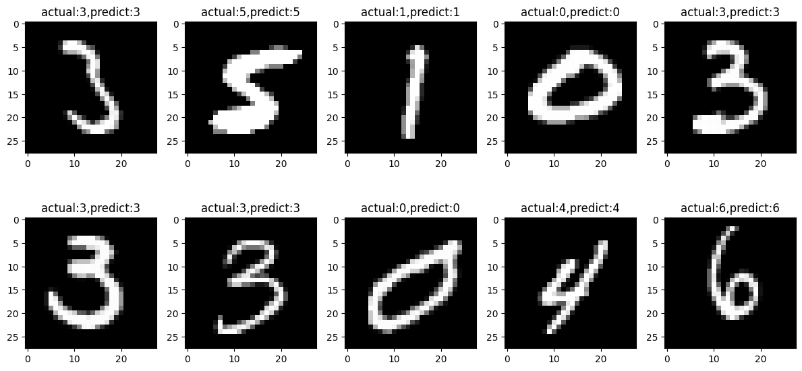

# MNIST Digit Classifier Using Keras Sequential and Dense Layers (Hugging Face Dataset)

This project demonstrates a simple handwritten digit classifier built using:
- The [MNIST dataset](https://huggingface.co/datasets/ylecun/mnist) (loaded via Hugging Face in Parquet format)
- A **Dense-only** neural network using Keras' **Sequential API**
- No CNNs, Dropout, or advanced techniques — just clean and beginner-friendly code

---

## 📂 Project Structure

- `mnist.py` – full training, evaluation, and prediction code
- `MNIST.h5` – saved trained model
- `Module_results.png` – 10 random test predictions with actual vs predicted labels

---

## 📊 Model Architecture

The model is built using only Dense layers:

```python
model = Sequential([
    Dense(128, activation='relu', input_shape=(784,)),
    Dense(64, activation='relu'),
    Dense(10, activation='softmax')
])
```

Compiled with:

```python
model.compile(
    optimizer='adam',
    loss='sparse_categorical_crossentropy',
    metrics=['accuracy']
)
```

---

## 🧠 Dataset

- Dataset: [MNIST](https://huggingface.co/datasets/ylecun/mnist) from Hugging Face
- Format: Parquet (compressed tabular format)
- Images are grayscale 28×28, normalized to range [0.0, 1.0]

---

## 📈 Training Performance

- Epochs: 100  
- Batch size: 196  
- Validation split: 20%

After full training, the model achieved:

```text
✅ Test Accuracy: 0.98 (98%)
```

---

## 🖼️ Sample Predictions

Below are 10 randomly selected images from the test set along with their actual and predicted values:



---

## 💾 Saved Model

The trained model is saved as:

```bash
MNIST.h5
```

You can reload it with:

```python
from keras.models import load_model
model = load_model("MNIST.h5")
```

---

## 🚀 How to Run

1. Install requirements:
   ```bash
   pip install pandas numpy pillow matplotlib tensorflow
   ```

2. Run the script:
   ```bash
   python mnist.py
   ```

3. (Optional) Reuse the trained model:
   ```python
   model = load_model("MNIST.h5")
   ```

---

## 📚 Summary

This project is a clean, minimal example of:
- Loading real-world data (in Parquet format) from Hugging Face
- Building a simple deep learning classifier with no complex tricks
- Reaching high accuracy (~98%) using only Dense layers

---

> 🎓 Perfect for students, beginners, or those new to Keras and image classification.
